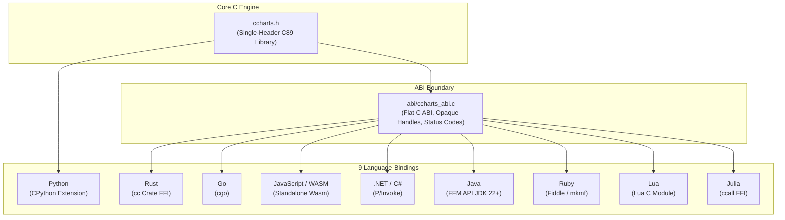

# Architecture & Engine Design

This document details the internal architecture, mathematical models, downsampling algorithms, sub-pixel rendering pipelines, and memory model of `ccharts`.

---

## 1. Architectural Principles & Layering

`ccharts` is designed around four foundational constraints:
1. **Strings Out, Not Streams**: No canvas, no terminal curses/ioctl calls, no stdout writes. A single function call produces an immutable heap-allocated UTF-8 string.
2. **Zero Runtime Dependencies**: The entire core engine is written in standard, portable C89.
3. **Byte-for-Byte Determinism**: For any given input data, dimensions, and settings, every language binding generates the exact same byte sequence.
4. **Strict Memory Bounding**: Every allocation is bounded by explicit limits (`CC_MAX_DIM`, `CC_MAX_CELLS`) to prevent memory exhaustion and buffer overflows.

### Layering Diagram



---

## 2. The 5-Stage Rendering Pipeline

```
  1. Input Ingestion & Validation
  ┌────────────────────────────────────────────────────────┐
  │ CSV / JSON / Native Float64 Buffers / Series Matrices   │
  └───────────────────────────┬────────────────────────────┘
                              ▼
  2. Column Mapping & Downsampling
  ┌────────────────────────────────────────────────────────┐
  │ - Line/Spark: Span Mean Averaging                      │
  │ - Candle: OHLC Aggregation (First, Max, Min, Last)     │
  │ - Bar/Stack: Categorical Folding (MAX / SUM)           │
  │ - Heatmap: 2-D Block Averaging                         │
  │ - Box Plot: Nearest-Rank 5-Number Summary              │
  └───────────────────────────┬────────────────────────────┘
                              ▼
  3. Coordinate Transformation & Sub-pixel Glyphs
  ┌────────────────────────────────────────────────────────┐
  │ - 8-Level Vertical Sub-pixels (▁..█)                  │
  │ - 2-Level Bitmask Grid (▀, ▄, █) + Wicks (│)          │
  │ - Elliptical Aspect Ratio Correction (2:1 Terminal)    │
  │ - 10-Step Deterministic Colormap Ladder                │
  └───────────────────────────┬────────────────────────────┘
                              ▼
  4. Cell Grid Layout & 32-Byte Slot Allocation
  ┌────────────────────────────────────────────────────────┐
  │ Fixed Buffer: columns[(x * height + y) * 32]           │
  │ [ANSI Escape] + [Unicode Glyph] + [ANSI Reset] + \0    │
  └───────────────────────────┬────────────────────────────┘
                              ▼
  5. Chart Assembly & Framing
  ┌────────────────────────────────────────────────────────┐
  │ - Row-by-row Top-to-Bottom Join                        │
  │ - Left Margin (8-char Price/Count Value Axis)          │
  │ - Footer (Time Axis / Category Labels / Legend)        │
  └────────────────────────────────────────────────────────┘
```

---

## 3. Mathematical & Downsampling Models

### 3.1. Line & Sparkline Downsampling (`span_mean`)
When the chart width in character columns is less than the number of data points ($W < N$), columns aggregate contiguous chunks of data points. For column $x \in [0, W-1]$, the data slice is:
$$i_{start} = \lfloor x \cdot \frac{N}{W} \rfloor, \quad i_{end} = \lfloor (x + 1) \cdot \frac{N}{W} \rfloor$$
The representative price for column $x$ is the arithmetic mean of close prices in that slice:
$$\bar{P}_x = \frac{1}{i_{end} - i_{start}} \sum_{i=i_{start}}^{i_{end} - 1} P[i]$$

### 3.2. Candlestick Aggregation (`cc_agg_ohlc`)
Candlestick charts preserve market mechanics during downsampling:
$$\begin{aligned}
\text{Open}_x &= \text{Open}[i_{start}] \\
\text{High}_x &= \max_{i \in [i_{start}, i_{end})} \text{High}[i] \\
\text{Low}_x &= \min_{i \in [i_{start}, i_{end})} \text{Low}[i] \\
\text{Close}_x &= \text{Close}[i_{end} - 1]
\end{aligned}$$

### 3.3. Sub-Pixel Vertical Mapping (`cc_pixel`)
Given data minimum $V_{min}$ and maximum $V_{max}$, a value $v$ maps to a continuous sub-pixel coordinate:
$$\text{level}(v) = \begin{cases} 
\lfloor \frac{H \cdot 8}{2} \rfloor & \text{if } V_{max} == V_{min} \\
\lfloor \frac{v - V_{min}}{V_{max} - V_{min}} \cdot (H \cdot 8 - 1) \rfloor & \text{otherwise}
\end{cases}$$
Where $H$ is the chart height in cells. Each cell row $r \in [0, H-1]$ spans 8 sub-pixels ($[r \cdot 8, r \cdot 8 + 7]$).

### 3.4. Terminal Aspect Ratio Compensation (Pie/Donut)
Terminal fonts have rectangular character cells where the character height $h_{char}$ is typically twice its width $w_{char}$ ($h/w \approx 2.0$). 
In `cc_pie_create`, normalized cell coordinates $(x', y')$ are computed as:
$$x' = \frac{x - x_c}{R_x}, \quad y' = \frac{y - y_c}{R_y} \cdot \text{ASPECT\_RATIO}$$
This radial correction prevents circle distortion and renders true circular disks in monospace terminal environments.

### 3.5. Box Plot Nearest-Rank Statistics
For an ordered sample vector $s[0..n-1]$:
$$\begin{aligned}
Min &= s[0] \\
Q_1 &= s[\lfloor (n - 1) \times 0.25 \rfloor] \\
Median &= s[\lfloor (n - 1) \times 0.50 \rfloor] \\
Q_3 &= s[\lfloor (n - 1) \times 0.75 \rfloor] \\
Max &= s[n - 1]
\end{aligned}$$

---

## 4. Memory Layout & Fixed Cell Budget

### 4.1. The 32-Byte Cell Slot Contract
The grid buffer allocates a contiguous flat memory block:
$$\text{Buffer Size} = \text{Width} \times \text{Height} \times 32 \text{ bytes}$$
Every cell $(x, y)$ is addressed by:
$$\text{Offset} = (x \times \text{Height} + y) \times 32$$

Each 32-byte slot is structured to hold:
1. **ANSI Color Escape Sequence**: Up to 19 bytes (e.g., truecolor `\x1b[38;2;RRR;GGG;BBBm` or 256-color `\x1b[38;5;NNNm`).
2. **Unicode UTF-8 Glyph**: Up to 4 bytes (e.g., `█` `0xE2 0x96 0x88`).
3. **ANSI Reset Sequence**: 4 bytes (`\x1b[0m`).
4. **NUL Terminator**: 1 byte (`\0`).

Total budget: $19 + 4 + 4 + 1 = 28 \text{ bytes} \le 32 \text{ bytes}$.
This invariant guarantees that cell rendering never reallocates or exceeds slot boundaries.

### 4.2. Avoidance of Variable-Length Arrays (VLAs)
All intermediate buffers are explicitly heap-allocated using `malloc`/`calloc` and freed before returning. This guarantees full compatibility with MSVC (which does not support C99 VLAs) and prevents stack overflow vulnerabilities on large chart dimensions.

---

## 5. Timestamp Calculation & Interval Formatting

`ccharts` includes a dedicated civil-calendar epoch parser (`cc_iso8601_to_epoch`) based on Howard Hinnant's algorithm:
- Parses ISO 8601 strings and handles explicit UTC offsets (`+HH:MM`, `+HHMM`, `+HH`, `Z`).
- Converts time directly to UTC epoch seconds without relying on system `timegm` or timezone environment variables.
- Automatically derives axis date formatting from the average candle spacing:
  - $\Delta t \ge 86400\text{ s}$ (Daily or greater): `YYYY-MM-DD`
  - $\Delta t < 86400\text{ s}$ (Intraday): `HH:MM`
